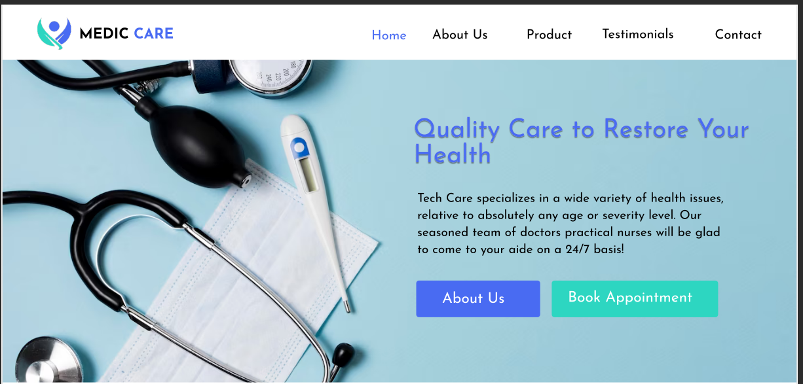
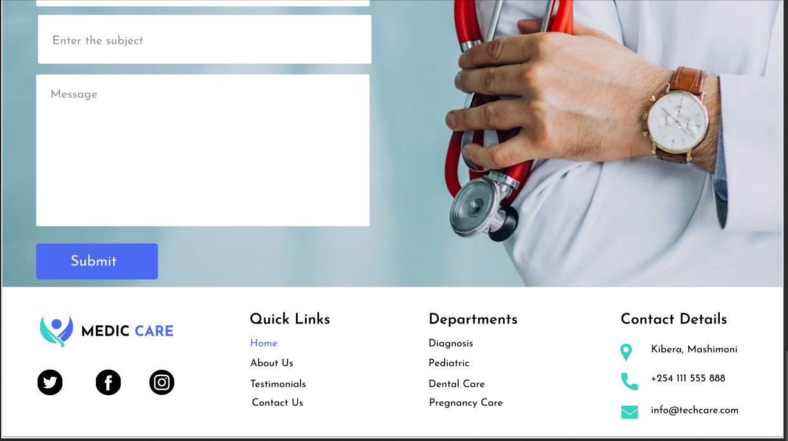

# MEDICAL 

### Project descrption
An innovatve company that helps patient to know more about there treaments and how services that are available can help them.

## screenshots 
this is how the project looks like
- Homepage sections

- Footer page
  
## technologies used
* Html5
* Css
## projectsetup and installation
1. Open the terminal and navigate to were u want to store the project e.g cd ~Desktop~
2. To clone the github project paste this on the terminal ~gitclone[https://github.com/zarajin7/medical.git]~
3. Use cd medical to get into the project directory
4. Open your project with your favourite browser
## Live link
toacces the project live use this click[here]![https://zarajin7.github.io/medical/] 
## Colaboration 
if you would like to get in contact or if you have more information ,feedback,colaboration and question please contact us at zahraabdallajin@Gmail.com
## licencs
MIT License

Copyright (c) [2024] ***[ Zahra Ali]***

Permission is hereby granted, free of charge, to any person obtaining a copy
of this software and associated documentation files (the "Software"), to deal
in the Software without restriction, including without limitation the rights
to use, copy, modify, merge, publish, distribute, sublicense, and/or sell
copies of the Software, and to permit persons to whom the Software is
furnished to do so, subject to the following conditions:

The above copyright notice and this permission notice shall be included in all
copies or substantial portions of the Software.

THE SOFTWARE IS PROVIDED "AS IS", WITHOUT WARRANTY OF ANY KIND, EXPRESS OR
IMPLIED, INCLUDING BUT NOT LIMITED TO THE WARRANTIES OF MERCHANTABILITY,
FITNESS FOR A PARTICULAR PURPOSE AND NONINFRINGEMENT. IN NO EVENT SHALL THE
AUTHORS OR COPYRIGHT HOLDERS BE LIABLE FOR ANY CLAIM, DAMAGES OR OTHER
LIABILITY, WHETHER IN AN ACTION OF CONTRACT, TORT OR OTHERWISE, ARISING FROM,
OUT OF OR IN CONNECTION WITH THE SOFTWARE OR THE USE OR OTHER DEALINGS IN THE
SOFTWARE.